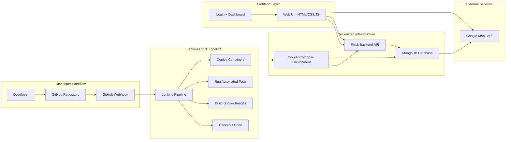

# Summer Bucket List App

A collaborative full-stack web application that allows users to create, manage, and visualize their summer bucket list activities. The app is built using Flask, MongoDB, Docker, Jenkins CI/CD, and Google Maps API to demonstrate a complete cloud-native DevOps workflow.

The system supports multi-user authentication, where each user has their own private lists and cannot access or modify other users’ data.

---

# Features

- User authentication (signup/login using username & password)
- Multi-user support with isolated personal data
- Create and manage multiple bucket lists per user
- Add/remove items from lists
- Mark/unmark items as completed
- Categorize items (Travel, Fun, Personal, Adventure, etc.)
- Track progress with completion status
- Store data persistently using MongoDB
- Visualize locations using Google Maps (latitude/longitude from DB)
- Fully containerized using Docker & Docker Compose
- Automated CI/CD pipeline using Jenkins

---

# Tech Stack

| Category | Tools & Technologies Used |
|------|------------------|
| Backend | Python, Flask, PyMongo |
| Frontend | HTML, CSS, JavaScript |
| Database | MongoDB |
| DevOps / Tools | Docker, Docker Compose, Jenkins, GitHub |
| APIs | Google Maps JavaScript API |

---

# Database Design

The backend follows a relational-style schema design using MongoDB collections. Each document has MongoDB’s default `_id` (ObjectId); other collections reference those IDs in foreign-key-style fields.

### `users`
Stores authentication data.

- `_id`
- `username` (unique)
- `password_hash` (set at signup; plain passwords are not stored)

---

### `catalog_items`
Stores the seeded master catalog of bucket list activities (coordinates used for maps).

- `_id`
- `name`
- `category`
- `due_date`
- `location.latitude`
- `location.longitude`

---

### `lists`
Stores user-created bucket lists.

- `_id`
- `user_id` (references `users._id`)
- `name`

Relationship:

- One user → Many lists

---

### `list_items` (join collection)
Handles the many-to-many relationship between lists and catalog items; completion is per list entry.

- `_id`
- `list_id` (references `lists._id`)
- `catalog_item_id` (references `catalog_items._id`)
- `completed` (boolean)

Relationship:

- One list → Many catalog items (via join rows)
- One catalog item → Many lists (via join rows)

Unique index on `(list_id, catalog_item_id)` prevents duplicates.

---

# API Design (Flask REST API)

The backend exposes RESTful APIs that return JSON only (no server-side rendering). Backend setup and API-specific documentation live with the Flask code:

- [Backend setup](app/README.md)
- [API route reference](app/backend/README.md)

---

## Authentication APIs

- Sign up user
- Validate user login

---

## List APIs

- Create a new list
- Delete a list
- Get all lists for a user

---

## Item APIs

- Get all seeded items
- Add item to a list
- Remove item from a list
- Get all items in a list
- Mark item as complete
- Unmark item as complete
- Get specific item details (including coordinates)

---

# 2.2 Architecture Overview

The diagram shows how the system connects across development, CI/CD, backend services, database, and frontend visualization layers.

A developer push to GitHub triggers Jenkins via webhook. Jenkins executes the CI/CD pipeline which includes code checkout, Docker image build, automated testing, and deployment of containers. The Flask backend exposes REST APIs consumed by the frontend. MongoDB handles persistent storage for users, lists, and items. Google Maps is used only for visualization using stored latitude and longitude values from the database.

---

# Team Responsibilities

This project follows a CI/CD workflow where development flows from setup → infrastructure → backend → frontend → testing → deployment.

---

## 1. Devanshi — CI/CD Pipeline & Orchestration

### Pipeline Setup
- Set up Jenkins server
- Integrated Jenkins with GitHub repository
- Designed full CI/CD pipeline:
  - Checkout → Build → Test → Deploy
- Configured GitHub webhook triggers
- Configured Google Maps API key in Google Cloud Console with restrictions
- Debugged pipeline failures and ensured stability

### Jenkins Contribution
- Owned full Jenkins pipeline architecture
- Managed GitHub → Jenkins integration
- Configured automated pipeline execution

---

## 2. Aarav — Docker & Containerization

### Containerization Layer
- Created Dockerfile for Flask backend
- Built Docker Compose for Flask + MongoDB
- Configured persistent MongoDB volumes
- Managed environment variables (including API keys)
- Ensured container networking and service communication

### Jenkins Contribution
- Owned Build stage in CI/CD pipeline
- Implemented Docker build and deployment commands in Jenkinsfile
- Ensured successful container startup during pipeline execution

---

## 3. Jasmine — MongoDB Configuration, Security & Infrastructure Setup

### Database + Infrastructure Layer
- Designed MongoDB schema structure
- Configured user authentication database
- Created seeded items dataset with coordinates
- Designed many-to-many relationship (lists ↔ items)
- Built system architecture diagram
- Ensured secure handling of API keys

### Jenkins Contribution
- Stored MongoDB credentials in Jenkins Credentials Manager
- Stored Google Maps API key securely in Jenkins
- Documented secure setup process

---

## 4. Daniel — Flask Backend Development

### Backend Development
- Built RESTful Flask API (JSON only)
- Implemented authentication system (signup/login)
- Developed CRUD operations for lists and items
- Implemented item completion tracking
- Connected Flask to MongoDB using PyMongo
- Added `/health` endpoint for monitoring

### Jenkins Contribution
- Added dependency installation stage
- Ensured Flask backend starts successfully in pipeline

---

## 5. Lavanya — Frontend/UI Development

### User Interface Development
- Designed frontend using HTML/CSS/JavaScript
- Built login and dashboard pages
- Created bucket list management UI
- Added progress tracking system
- Integrated Google Maps visualization
- Implemented category-based UI design

### Jenkins Contribution
- Configured artifact archiving after deployment
- Saved UI build screenshots for validation

---

## 6. Maia — Testing & Verification

### Quality Assurance
- Developed API test scripts
- Verified MongoDB connectivity
- Tested authentication system
- Validated API responses
- Ensured Google Maps integration works with DB coordinates

### Jenkins Contribution
- Owned Verify stage in pipeline
- Integrated automated testing into Jenkins
- Ensured pipeline failure on test errors

---

# Setup Instructions

Project-wide setup will be finalized once all team components are complete. Current backend setup instructions are in [app/README.md](app/README.md).

---

# Future Improvements

- Role-based access control
- Search & filtering for items
- Sharing lists between users (optional feature)
- Mobile responsiveness improvements
- Cloud deployment (AWS / Azure / GCP)
- Kubernetes orchestration
